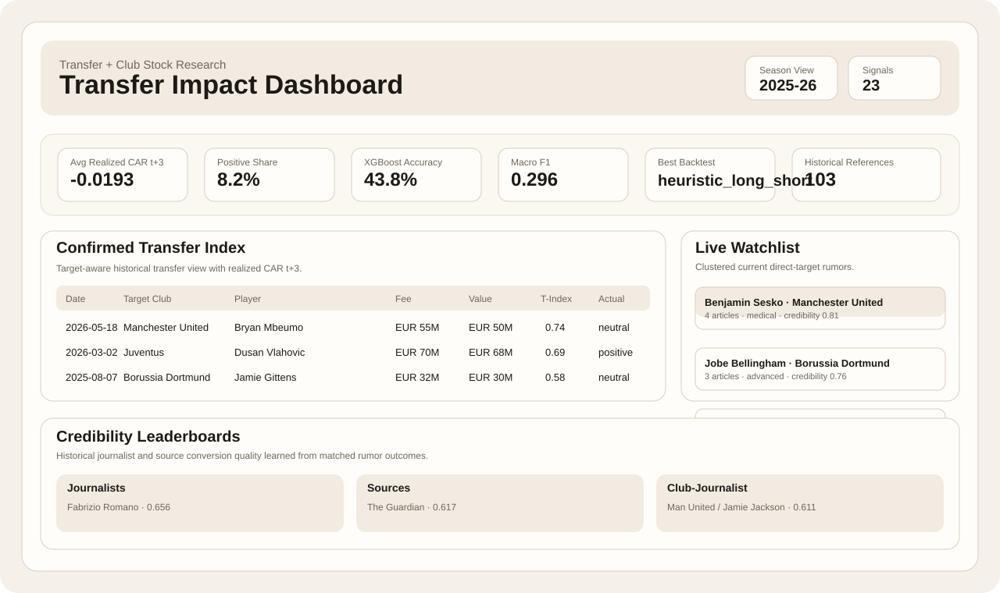
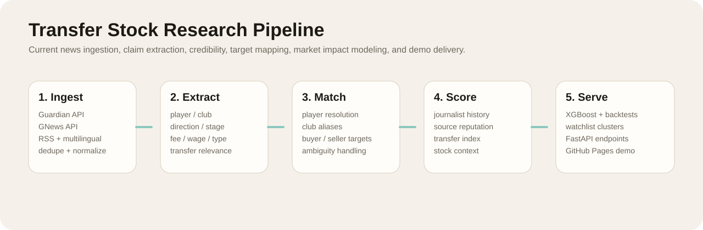

# Transfer Scrape

Research scaffold for studying how football transfer news and confirmed player
transfers affect publicly traded football club stocks.

Planned GitHub Pages URL after deployment:

- `https://<your-github-username>.github.io/transfer_scrape/`





The configured public universe now includes:

- Manchester United
- Borussia Dortmund
- Juventus
- Lazio
- Ajax NV
- Sporting CP SAD
- FC Porto SAD
- Celtic plc
- Benfica SAD
- Eagle Football Group

## Start Here

If you just want to see the project working:

```bash
source .venv/bin/activate

PYTHONPATH=src .venv/bin/python -m transfer_stock.cli refresh-live-analyze \
  --input data/raw/articles/current_fast.jsonl \
  --clubs manchester_united juventus ajax \
  --slug current_fast \
  --dashboard-output app/static/data/dashboard_data.json

python3 -m http.server 8000 --directory app/static
```

Open `http://127.0.0.1:8000`.

The site reads from:

- `app/static/data/dashboard_data.json`

Everything else in this README is the fuller pipeline and publishing reference.

## What This Project Is

The core idea is solid, but it needs to be framed carefully:

- Confirmed transfers are usually late information. Stock prices may react
  earlier, when credible rumors appear.
- Football club stocks are thinly traded and affected by match results,
  earnings, European qualification, ownership news, and broader markets.
- The most defensible financial target is not raw price movement. Use abnormal
  returns around an event window, then train on those event-study outputs.
- Wage data is often estimated. Keep source fields and confidence scores so the
  model can learn uncertainty instead of treating every number as truth.

This repo starts with a practical MVP:

1. Ingest historical transfers from CSV exports or public datasets.
2. Download stock price history for listed clubs.
3. Collect transfer-rumor/news articles with GDELT.
4. Build quality and credibility features.
5. Compute event-study abnormal returns.
6. Score current rumors for likely market impact.

## Recommended Data Sources

Use these in this order:

- Historical transfers: public Transfermarkt-derived datasets, or exports from
  `worldfootballR` functions such as `tm_team_transfers()` and
  `tm_player_transfer_history()`. Direct scraping Transfermarkt pages can be
  fragile and may violate site restrictions, so this project treats it as an
  ingestion source rather than hard-coding aggressive scraping.
- Wages: FBref/Capology via `worldfootballR::fb_squad_wages()` where available.
  Treat wages as estimates.
- Stock prices: Yahoo chart endpoint by default, with Stooq CSV support when
  you provide an API key.
- News and rumors: GDELT DOC API for broad article discovery. Later, add curated
  RSS feeds and journalist/source credibility overrides.

## Listed Clubs In The Starter Config

| Club | Default stock symbol | Notes |
| --- | --- | --- |
| Manchester United | `MANU` | NYSE ticker |
| Borussia Dortmund | `BVB.DE` | German listing |
| Juventus | `JUVE.MI` | Italian listing |
| Lazio | `SSL.MI` | Italian listing |

If a symbol does not return data, edit `config/clubs.yml`.

## Install

This first version uses Python standard library plus `requests` and `PyYAML`,
which are already available in the current environment.

```bash
python3 -m transfer_stock.cli --help
```

Stage 1 of the upgrade guide adds a v2 ingestion path with optional extras:

```bash
pip install -e ".[scrape_v2]"
pip install -e ".[ai_scrape]"
pip install -e ".[claim_ai]"
pip install -e ".[market_research]"
pip install -e ".[ml_pipeline]"
pip install -e ".[api_server]"
```

These extras are optional. The repo still works without them and will fall back
to provider APIs, RSS ingestion, and a pure-Python market engine where
possible. For the stronger current-news path, the most useful install right now
is:

```bash
pip install -e ".[scrape_v2,api_server]"
```

Then you can add:

```bash
pip install -e ".[ai_scrape]"
```

if you want Crawl4AI body enrichment for thinner article pages.

## Quick Start

Run the demo pipeline with bundled sample transfers:

```bash
python3 -m transfer_stock.cli demo
```

Clean raw transfer files into one season-aware table:

```bash
python3 -m transfer_stock.cli clean-transfers
```

Expand the dataset with public Transfermarkt-derived league CSVs from
`ewenme/transfers`:

```bash
python3 -m transfer_stock.cli import-ewenme-transfers --start-season 2021-22 --end-season 2025-26
python3 -m transfer_stock.cli clean-transfers
```

This pulls Premier League, Bundesliga, and Serie A by default, then filters to
the configured public clubs. The source has season/window-level timing rather
than exact announcement dates, so imported rows use proxy dates: July 1 for
summer moves and January 1 for winter moves.

Loans are kept by default but marked with `transfer_type` and `is_loan`. To
exclude them from event/model data:

```bash
python3 -m transfer_stock.cli clean-transfers --loan-policy exclude
```

Fetch stock data:

```bash
python3 -m transfer_stock.cli fetch-stocks --start 2023-01-01 --end 2026-04-19

# Fetch only a subset when you do not want the full public-club universe.
python3 -m transfer_stock.cli fetch-stocks \
  --source yahoo \
  --start 2021-01-01 \
  --end 2026-05-01 \
  --clubs manchester_united ajax fc_porto
```

Stooq currently asks for an API key on direct CSV downloads. To use it, set:

```bash
export STOOQ_API_KEY=your_key_here
python3 -m transfer_stock.cli fetch-stocks --source stooq
```

Fetch current transfer news:

```bash
python3 -m transfer_stock.cli fetch-news --days 14
```

Fetch normalized articles into the v2 article store:

```bash
python3 -m transfer_stock.cli fetch-news-v2 --start 2026-04-01 --end 2026-05-19
python3 -m transfer_stock.cli inspect-ingestion --input data/raw/articles/articles_v2.jsonl
```

Normalize an existing raw JSONL file into the v2 article schema:

```bash
python3 -m transfer_stock.cli normalize-articles \
  --input data/raw/news/provider_club_news_2025_26_combined.jsonl \
  --output data/raw/articles/provider_club_news_2025_26_normalized.jsonl
```

Extract structured transfer claims from normalized articles:

```bash
python3 -m transfer_stock.cli extract-claims \
  --input data/raw/articles/provider_club_news_2025_26_normalized.jsonl \
  --output data/processed/claims/provider_club_news_2025_26_claims.jsonl

python3 -m transfer_stock.cli inspect-claims \
  --input data/processed/claims/provider_club_news_2025_26_claims.jsonl
```

The default claim extractor is a tested heuristic backend. If you install
`dspy` and configure a model, you can request the DSPy backend explicitly:

```bash
export DSPY_MODEL=openai/gpt-5-mini
python3 -m transfer_stock.cli extract-claims --backend dspy
```

Match extracted claims to likely transfer records:

```bash
python3 -m transfer_stock.cli match-claims \
  --claims data/processed/claims/provider_event_news_2025_26_top50_claims.jsonl \
  --transfers data/processed/transfers_exact_dates.csv \
  --output data/processed/matched_claims/provider_event_news_2025_26_top50_matches.csv

python3 -m transfer_stock.cli inspect-matches \
  --input data/processed/matched_claims/provider_event_news_2025_26_top50_matches.csv
```

Build richer credibility features from the claim and match history:

```bash
python3 -m transfer_stock.cli score-credibility \
  --claims data/processed/claims/provider_event_news_2025_26_top50_claims.jsonl \
  --matches data/processed/matched_claims/provider_event_news_2025_26_top50_matches.csv \
  --transfers data/processed/transfers_exact_dates.csv \
  --output-dir data/processed/credibility/provider_event_news_2025_26_top50

python3 -m transfer_stock.cli inspect-credibility \
  --input data/processed/credibility/provider_event_news_2025_26_top50/scored_claims.jsonl
```

This writes:

- `scored_claims.jsonl`: claim-level credibility scores and subcomponents
- `scored_claims.csv`: same scored claims in table form
- `source_stats.csv`: source-level historical match rates
- `journalist_stats.csv`: journalist-level historical match rates
- `club_journalist_stats.csv`: club-specific journalist hit rates

Run the same credibility pipeline over the larger historical 2021-25 event-news
set:

```bash
python3 -m transfer_stock.cli merge-jsonl \
  --output data/raw/news/historical_event_news_2021_25.jsonl \
  --inputs data/raw/news/combined_event_news_top.jsonl data/raw/news/event_news.jsonl \
  --dedupe

python3 -m transfer_stock.cli normalize-articles \
  --input data/raw/news/historical_event_news_2021_25.jsonl \
  --output data/raw/articles/historical_event_news_2021_25_normalized.jsonl

python3 -m transfer_stock.cli extract-claims \
  --input data/raw/articles/historical_event_news_2021_25_normalized.jsonl \
  --output data/processed/claims/historical_event_news_2021_25_claims.jsonl

python3 -m transfer_stock.cli match-claims \
  --claims data/processed/claims/historical_event_news_2021_25_claims.jsonl \
  --transfers data/processed/transfers_exact_dates.csv \
  --output data/processed/matched_claims/historical_event_news_2021_25_matches.csv

python3 -m transfer_stock.cli score-credibility \
  --claims data/processed/claims/historical_event_news_2021_25_claims.jsonl \
  --matches data/processed/matched_claims/historical_event_news_2021_25_matches.csv \
  --transfers data/processed/transfers_exact_dates.csv \
  --output-dir data/processed/credibility/historical_event_news_2021_25
```

Build richer market research features aligned to rumor rows:

```bash
python3 -m transfer_stock.cli build-market-features \
  --input data/processed/rumor_events_grouped.csv \
  --output data/processed/market_features/rumor_events_grouped_market.csv

python3 -m transfer_stock.cli inspect-market-features \
  --input data/processed/market_features/rumor_events_grouped_market.csv
```

The market-feature layer keeps pre-rumor context separate from post-rumor
evaluation windows. Safe pre-event columns include fields such as
`pre_raw_return_m10`, `pre_abnormal_return_m10`, `pre_volatility_20d`, and
`pre_close_zscore_20d`. Post-event evaluation columns include
`abnormal_return_0_p3`, `abnormal_return_0_p10`, `volatility_shift_20d`, and
`target_label_p3`.

Build the Stage 6 claim-level ML dataset from the historical and 2025-26
scored-claim files:

```bash
PYTHONPATH=src python3 -m transfer_stock.cli build-stage6-dataset
```

The Stage 6 base dataset is now target-aware:

- one matched rumor can expand into a public `buyer` row, a public `seller`
  row, or both if both clubs are listed
- rows without any public target stay in the dataset with
  `prediction_scope = none`
- those intelligence-only rows keep credibility and transfer context, but the
  market-label and ML path do not assign them fake stock-impact predictions

Train the stronger temporal tabular models:

```bash
PYTHONPATH=src .venv/bin/python -m transfer_stock.cli train-model-v2 \
  --dataset data/processed/modeling/stage6_claims_market.csv \
  --predictions-dir data/models/stage6 \
  --metrics data/models/stage6/metrics_stage6.json \
  --train-end-season 2024-25
```

The Stage 6 trainer now keeps the same CLI but does a small validation-based
model selection pass for XGBoost. It compares a full feature set against a
pruned core feature set and picks the better validation configuration before
writing the final prediction files.

This writes:

- `data/processed/modeling/stage6_claims_market.csv`
- `data/models/stage6/stage6_logistic_predictions.csv`
- `data/models/stage6/stage6_xgboost_predictions.csv`
- `data/models/stage6/metrics_stage6.json`

Run Stage 7 backtests on the XGBoost predictions:

```bash
PYTHONPATH=src .venv/bin/python -m transfer_stock.cli run-backtests \
  --predictions data/models/stage6/stage6_xgboost_predictions.csv \
  --output-dir data/reports/backtests \
  --holding-days 3 \
  --positive-threshold 0.55 \
  --negative-threshold 0.55 \
  --credibility-threshold 0.65

PYTHONPATH=src python3 -m transfer_stock.cli inspect-backtests \
  --input data/reports/backtests/backtest_summary.csv
```

This writes:

- `data/reports/backtests/backtest_summary.csv`
- `data/reports/backtests/backtest_trades.csv`
- `data/reports/backtests/backtest_daily_returns.csv`
- `data/reports/backtests/backtest_report.md`

Build the Stage 8 dashboard payload from the main Stage 6/7 outputs:

```bash
PYTHONPATH=src python3 -m transfer_stock.cli build-demo-data \
  --predictions data/models/stage6/stage6_xgboost_predictions.csv \
  --metrics data/models/stage6/metrics_stage6.json \
  --backtest-summary data/reports/backtests/backtest_summary.csv \
  --backtest-trades data/reports/backtests/backtest_trades.csv \
  --transfers data/processed/transfers_exact_dates.csv \
  --journalist-stats data/processed/credibility/historical_event_news_2021_25/journalist_stats.csv \
  --source-stats data/processed/credibility/historical_event_news_2021_25/source_stats.csv \
  --club-journalist-stats data/processed/credibility/historical_event_news_2021_25/club_journalist_stats.csv \
  --output app/static/data/dashboard_data.json

PYTHONPATH=src python3 -m transfer_stock.cli inspect-demo-data \
  --input app/static/data/dashboard_data.json
```

The dashboard reads from:

- `app/static/data/dashboard_data.json`
- `data/models/stage6/stage6_xgboost_predictions.csv`
- `data/models/stage6/metrics_stage6.json`
- `data/reports/backtests/backtest_summary.csv`
- `data/reports/backtests/backtest_trades.csv`

The payload now carries all available seasons (`2021-22` through `2025-26` in
the bundled demo data), so the dashboard can switch between past seasons and
show how the realized market impact changed over time. It also exposes
`target_club`, `target_ticker`, `target_role`, and `prediction_scope` so the
UI can distinguish direct public-club predictions from rows that would only be
credibility/transfer-quality assessments in a broader future pipeline.

The current dashboard also includes:

- a `Rumor Signals` view for target-aware rumor predictions
- a `Past Transfers` view for confirmed transfer quality and realized impact
- a `Live Watchlist` panel for the latest direct-target rumors
- journalist, source, and club-journalist credibility leaderboards

Serve the dashboard locally from the repo root:

```bash
python3 -m http.server 8000 --directory app/static
```

Then open `http://127.0.0.1:8000`.

Important:

- the website does **not** read `current_fast.jsonl` directly
- the website reads `app/static/data/dashboard_data.json`
- `current_fast.jsonl` is a normalized article-store input file
- you update the site by rebuilding `dashboard_data.json`

Fastest two-step workflow for current live data:

```bash
PYTHONPATH=src .venv/bin/python -m transfer_stock.cli refresh-live-fetch \
  --start 2026-05-01 \
  --end 2026-05-20 \
  --source-preset fast_no_api \
  --max-records 10 \
  --pause 0.1 \
  --clubs manchester_united juventus ajax \
  --output data/raw/articles/current_fast.jsonl

PYTHONPATH=src .venv/bin/python -m transfer_stock.cli refresh-live-analyze \
  --input data/raw/articles/current_fast.jsonl \
  --clubs manchester_united juventus ajax \
  --slug current_fast \
  --dashboard-output app/static/data/dashboard_data.json
```

After that, refresh the browser on `http://127.0.0.1:8000`.

Refresh the current-news dashboard in one command:

```bash
export GUARDIAN_API_KEY=your_guardian_key
export GNEWS_API_KEY=your_gnews_key

PYTHONPATH=src .venv/bin/python -m transfer_stock.cli refresh-live-dashboard \
  --start 2026-05-01 \
  --end 2026-05-20 \
  --provider all \
  --methods provider rss fundus \
  --clubs manchester_united borussia_dortmund juventus lazio ajax sporting_cp fc_porto celtic benfica eagle_football_group \
  --dashboard-output app/static/data/dashboard_data.json
```

If you want a much faster run without any API keys, use the new no-API preset:

```bash
PYTHONPATH=src .venv/bin/python -m transfer_stock.cli refresh-live-dashboard \
  --start 2026-05-01 \
  --end 2026-05-20 \
  --source-preset fast_no_api \
  --max-records 15 \
  --pause 0.1 \
  --no-refresh-stocks \
  --clubs manchester_united borussia_dortmund juventus lazio ajax \
  --dashboard-output app/static/data/dashboard_data.json
```

That preset uses repo-based and feed-based collection only:

- Guardian RSS
- BBC Football RSS
- Google News RSS

No Guardian API key or GNews API key required.

If you want a broader no-API mode and have `fundus` installed:

```bash
PYTHONPATH=src .venv/bin/python -m transfer_stock.cli refresh-live-dashboard \
  --start 2026-05-01 \
  --end 2026-05-20 \
  --source-preset balanced_no_api \
  --max-records 12 \
  --pause 0.1 \
  --no-refresh-stocks \
  --clubs manchester_united borussia_dortmund juventus lazio ajax sporting_cp fc_porto benfica \
  --dashboard-output app/static/data/dashboard_data.json
```

If you already fetched into `current_fast.jsonl`, you do **not** need to fetch
again. Just run:

```bash
PYTHONPATH=src .venv/bin/python -m transfer_stock.cli refresh-live-analyze \
  --input data/raw/articles/current_fast.jsonl \
  --clubs manchester_united juventus ajax \
  --slug current_fast \
  --dashboard-output app/static/data/dashboard_data.json
```

This command will:

1. fetch current provider club-news articles
2. normalize and dedupe them into the v2 article store
3. extract structured claims
4. match claims to likely transfers
5. score credibility using historical claim/match history as context
6. rebuild the Stage 6 dataset with the fresh live rows included
7. retrain the Stage 6 models
8. rerun the Stage 7 backtests
9. rebuild the Stage 8 dashboard payload

Artifacts for each refresh run are written under `data/live/<run_slug>/`, so
you can inspect a full run without overwriting older ones.

The source layer now includes multilingual RSS coverage for:

- Ajax in Dutch
- Sporting CP in Portuguese
- FC Porto in Portuguese
- Benfica in Portuguese

Those sources are additive to the Guardian/GNews flow and are intended to help
current-news refreshes pull better local coverage for clubs outside the
English-language bubble.

If `fundus` is installed, the same command can also pull directly from regional
publisher collections for:

- UK / Ireland coverage around Manchester United and Celtic
- Germany for Borussia Dortmund
- Italy for Juventus and Lazio
- Netherlands for Ajax
- Portugal for Sporting, Porto, and Benfica
- France for Eagle Football Group / Lyon

If `crawl4ai` is installed and you add `crawl4ai` to `--methods`, the v2
ingestion path will also try to enrich thin article bodies from article URLs
after the initial provider/RSS/Fundus collection.

Serve the same dashboard payload through a small FastAPI layer:

```bash
PYTHONPATH=src .venv/bin/python -m transfer_stock.cli serve-api \
  --payload app/static/data/dashboard_data.json \
  --host 127.0.0.1 \
  --port 8010
```

Useful endpoints:

- `GET /health`
- `GET /meta`
- `GET /signals/current?season=2025-26&club=Manchester%20United`
- `GET /signals/watchlist`
- `GET /transfers/history?season=2025-26`
- `GET /leaderboards/journalists`

## GitHub Demo

Yes, it is worth publishing a click-through demo page. This repo now includes:

- `.github/workflows/deploy-pages.yml` to deploy `app/static` to GitHub Pages
- `.github/workflows/nightly-refresh.yml` to refresh the live dashboard data on
  a nightly schedule and redeploy the Pages site

If your first deploy fails with a `Get Pages site failed` or `Not Found` error,
the usual fix is:

1. Open the repository on GitHub.
2. Go to `Settings -> Pages`.
3. Under `Build and deployment`, set `Source` to `GitHub Actions`.
4. Re-run the `Deploy Demo Page` workflow.

Before enabling the nightly refresh workflow, add these repository secrets:

- `GUARDIAN_API_KEY`
- `GNEWS_API_KEY`

Optional:

- `PAGES_PAT`

If you add `PAGES_PAT`, the workflow can try to auto-enable Pages for the repo.
Without it, manual enablement in the GitHub Pages settings is the simplest path.

Then enable GitHub Pages in the repository settings and point it at the
GitHub Actions deployment.

## Publish To GitHub

From the project root:

```bash
git init
git add .
git commit -m "Initial transfer-stock dashboard"
git branch -M main
git remote add origin https://github.com/<your-github-username>/transfer_scrape.git
git push -u origin main
```

Then in GitHub:

1. Open the repository.
2. Go to `Settings -> Pages`.
3. Under `Build and deployment`, choose `GitHub Actions`.
4. Go to `Settings -> Secrets and variables -> Actions`.
5. Add these repository secrets if you want API-backed refreshes:
   - `GUARDIAN_API_KEY`
   - `GNEWS_API_KEY`
6. Push again or manually run the `Deploy Demo Page` workflow.

Your Pages URL should become:

- `https://<your-github-username>.github.io/transfer_scrape/`

Once it is live, replace the placeholder URL near the top of this README with
your actual page URL.

Fetch historical news around known transfer events:

```bash
python3 -m transfer_stock.cli fetch-event-news --days-before 30 --days-after 3 --max-records 10 --pause 2
```

Score that historical event news and join it into a model table:

```bash
python3 -m transfer_stock.cli score-news --input data/raw/news/event_news.jsonl --output data/processed/scored_event_news.csv
python3 -m transfer_stock.cli build-model-dataset
```

Build event-study labels after you have transfer and stock data:

```bash
python3 -m transfer_stock.cli build-events --transfers data/processed/transfers_clean.csv --output data/processed/transfer_events.csv
python3 -m transfer_stock.cli build-events --transfers data/processed/transfers_clean_no_loans.csv --output data/processed/transfer_events_no_loans.csv --loan-policy exclude
```

Score current rumors:

```bash
python3 -m transfer_stock.cli score-news
```

## Transfer CSV Schema

Put historical transfers in `data/raw/transfers.csv` with these columns:

```csv
date,club,player,direction,from_club,to_club,age,position,market_value_eur,transfer_fee_eur,wage_eur_annual,transfer_type,is_loan,source,source_url
```

`direction` should be `in` or `out` from the listed club's perspective.
`transfer_type` can be `permanent`, `loan`, `loan_with_option`, or a similar
source label.

## Modeling Plan

The first label should be continuous:

- `car_m1_p1`: cumulative abnormal return from one trading day before to one
  day after the event.
- `car_0_p3`: cumulative abnormal return from event day to three trading days
  after.

Then derive classes only for interpretability:

- `negative`: CAR <= -2%
- `neutral`: -2% < CAR < 2%
- `positive`: CAR >= 2%

This keeps regression and classification both possible.

## Why Rumors Matter

A confirmed transfer date is often not the first market-moving date. A credible
report from a high-reputation journalist may move expectations before the club
announcement. The pipeline therefore stores both:

- confirmed transfer events
- rumor/news events with source credibility and transfer-quality features

## Current Limitations

- The transfer importer expects CSV data. It does not aggressively scrape
  Transfermarkt HTML.
- The exact-date transfer importer now strips future-dated rows and tags likely
  loan / loan-return pairs, but Transfermarkt-style loan semantics are still
  inferred heuristically from the raw dataset.
- The v2 ingestion architecture supports provider APIs, RSS, and Fundus-backed
  publisher crawling. Crawl4AI body enrichment is optional if installed.
- `scrapy-playwright` is still the next heavier crawler path for JS-heavy
  sources; it is installed via `.[scrape_v2]` but not yet the default fetch
  method in the live-refresh command.
- The Stage 2 claim extractor supports a real structured claim schema and a
  DSPy-ready backend, but the default runtime path is still a heuristic
  extractor until you configure an LM backend.
- The Stage 3 matcher favors lower false positives over maximum recall. Claims
  can be left unmatched or marked ambiguous instead of being forced onto the
  nearest transfer candidate.
- The starter model is a transparent heuristic because the repo has no large
  historical labeled dataset yet.
- Stock event studies need enough trading days before each event to estimate a
  baseline.
- News matching is keyword-based in the MVP. Entity resolution is the next big
  improvement.
